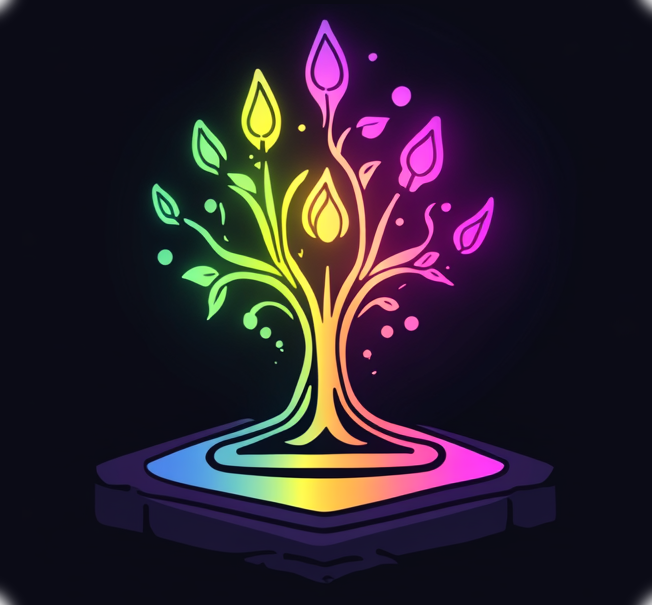

# ArcaneTable

A Magic: The Gathering playtesting simulator designed for the MTG community.

Check it out at https://arcanetable.app/



## 🌟 Features

- 🃏 **3D Card Simulation**: Test your Magic: The Gathering decks in a fully interactive 3D environment.
- 🤝 **Local Multiplayer Playtesting**: Playtest with friends using local connections or peer-to-peer networking.
- 🔍 **Deck Management**: Import, export, and manage your decks seamlessly.
- 🔧 **Customizable Settings**: Tailor the app to fit your playstyle and preferences.

> Arcanetable is designed in a generic way that could support other trading card games, but is currently hardcoded to point at scryfall

## 🚀 Getting Started

### Prerequisites

- **Browser**: A modern browser (Chrome, Firefox, or Edge recommended).
- **Node.js**: Version 16+.
- **pnpm**: Installed globally for package management:
  ```bash
  npm install -g pnpm
  ```
- **Git**: Installed for version control.

### Installation

1. Clone the repository:
   ```bash
   git clone https://github.com/odama626/arcanetable.git
   cd arcanetable
   ```
2. Install dependencies:
   ```bash
   pnpm install
   ```
3. Start the development server:
   ```bash
   pnpm dev
   ```

Visit `http://localhost:3000` to start playtesting!

### Deployment

1. Build the app:
   ```bash
   pnpm build
   ```
2. Serve the app (e.g., using Vercel, Netlify, or a Node.js server, or the supplied dockerfile).

## 🛠️ Contributing

Contributions are what make this project thrive! Here’s how you can help:

1. Fork the repository.
2. Create your feature branch:
   ```bash
   git checkout -b feature/YourFeatureName
   ```
3. Commit your changes:
   ```bash
   git commit -m "Add Your Feature"
   ```
4. Push to the branch:
   ```bash
   git push origin feature/YourFeatureName
   ```
5. Open a Pull Request.

## 💖 Support the Project

This app is free to use and relies on your generosity. You can support us by:

- [Donating on Patreon](https://patreon.com/arcanetable)
- Contributing to the codebase or documentation.

## 📝 License

This project is licensed under the **GNU Affero General Public License (AGPL)**. See [LICENSE](./LICENSE) for details.  
Contributors should ensure that all additions comply with AGPL requirements.

## 📫 Contact

For questions, suggestions, or just to say hi:

-  [@sparkstone.bsky.social](https://bsky.app/profile/sparkstone.bsky.social)
- Discord: Join our [Community Server](https://discord.gg/wzdj2W9vvf)

---

**Play. Contribute. Evolve.**  
Together, we can build the ultimate playtesting experience.
